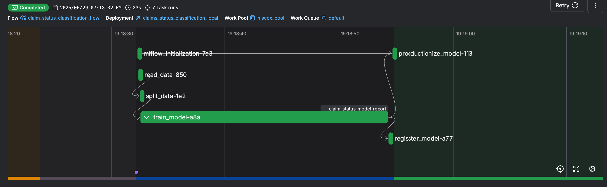
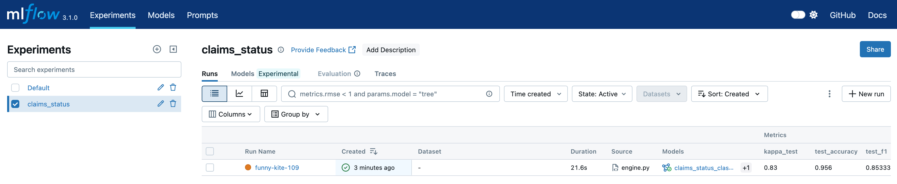
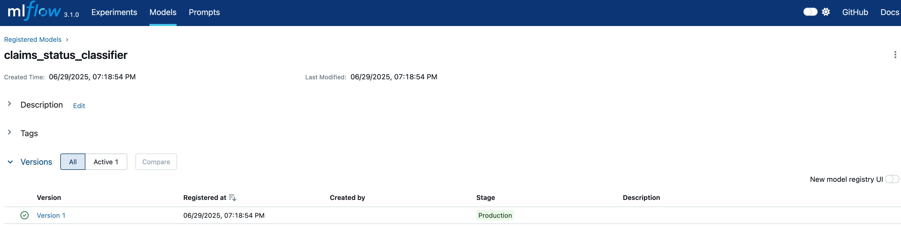
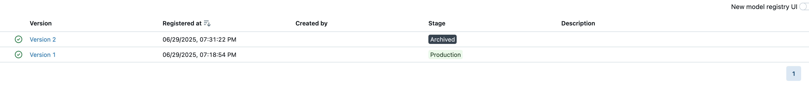
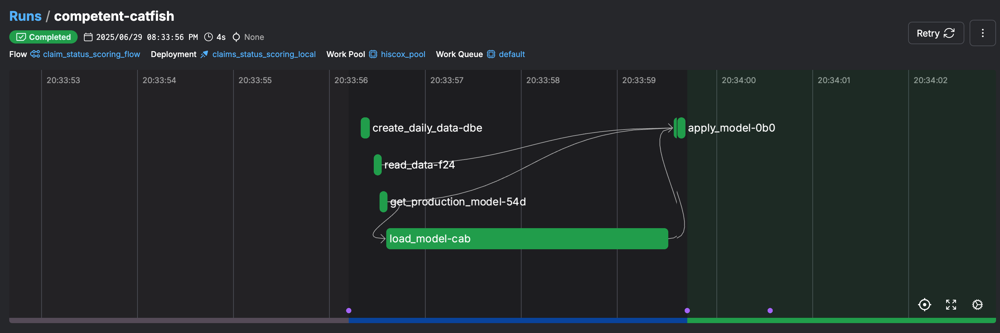

# hiscox

# Problem Description
The project demonstrates the data and modelling pipelines built based on the main aspects of MLOps, such as modelling experimentation and tracking, model registry, workflow orchestration, model deployment and monitoring. 

# Problem Statement and Objective
The Data Science team needs to determine the likelihood of claiming for each of the aproximately 1200 applications that Hiscox receives each day.
The objective is to create a production-ready MLOps pipeline where 
- a model is trained at the start of every month with data up to and including the previous month
- the applications received daily are scored as a batch job every night and used for filtering out risky customers and help manage the reserve that the business needs to hold.

# Technology Used
- python
- MLFlow for model experimentation, tracking, and registry
- Prefect for workflow orchestration
- AWS for cloud infrastructure: EC2 instance, RDS database and S3 bucket
- docker for deployment (daily scoring)


# Steps Overview
The order of the pipeline is as follows:
- Data Collection
- Model Experimentation, Tracking, and Orchestration
- Model Deployment
- Monitoring and Orchestration

## Data Collection
In a production environment, the training and daily data for scoring would be stored in a data warehouse.
For the purpose of this task, the data is generated via the code provided and stored as a csv file which is loaded from the disk at training time.
It is stored in **data/dataset_from_database.csv**

## Model Experimentation and Tracking
I started experimenting the solution with the original jupyter notebook provided, ml-engineer_pre-selection_task.ipynb. 
I then refactored the notebook code into a python script model_training/training.py. At this point, I removed all the EDA from the notebook and only kept the steps:
- connect to MLFlow tracking server
- read dataframe from csv file (in a real production environment from the data warehouse)
- create train test datasets
- hyperparameter tuning
- train the model with the best hyperparameters 
- register the model to MLFlow model registry
- stage the model to Production if no model exists already or if the kappa score is better then the current Production model

Amazon EC2, Amazon RDS and Amazon S3 were setup to host the MLFlow tracking server, to store MLFlow metadata and artifacts respectively.
In the final version of the code, the data used for training is also stored in the same S3 bucket.

## Model Orchestration
At this point, the current model orchestration can be done in a local Prefect server


# Steps to Replicate the Project - Version 1. Run locally
For the purpose of testing the scoring_local.py script locally with Prefect, you will need to fork this repo and push your own **mlartifacts** folder that gets generated after the model train to the repo. 
This is because Prefect pulls the code from the github repo and needs all the data and artifacts there.

- Setup the Local Environment
- Run the MLFlow Server
- Run the Prefect Server
- Create and Run the Training Deployment
- Create and Run the Scoring Deployment

## Setup the Local Environment
Create virtual environment and install requirements.txt.
Run the below
```bash
pip install pipenv
pipenv shell
pipenv install
```

## Run the MLFlow Server
```bash
mlflow ui --backend-store-uri sqlite:///mlflow.db
```
Go to http://127.0.0.1:5000 to access the server.
If we don't specify a local path to the model artifacts, by default MLFlow will save the experiment and runs in the local folder in 
**mlartifacts/<experiment_id>/<run_id>/artifacts/**.

## Run the Prefect Server
Open new terminal and activate the virtual environment.
```bash
pipenv shell
prefect server start
```
Go to http://127.0.0.1:4200 to access the server.

## Create and Run the Training Deployment
Open new terminal and activate the virtual environment.
```bash
pipenv shell

prefect deploy model_training/training_local.py:main_flow -n claims_status_classification_local -p hiscox_pool
prefect worker start --pool 'hiscox_pool'
```

Open new terminal and activate the virtual environment.
```bash
pipenv shell
prefect deployment run 'claim_status_classification_flow_local/claims_status_classification_local'
```

<p align="center">
  
</p>

<p align="center">
  
</p>

<p align="center">
  
</p>

You can run the deployment again either from the terminal or from the UI.
This will create a new model, but because the dataset is the same, the metrics will be the same, therefore it will be Archived.
<p align="center">
  
</p>

After you've run the training deployment, push the **mlartifacts** folder that got generated to the repo. 
This is because Prefect pulls the code from the github repo and needs all the data and artifacts there in order to find the model for scoring.


## Create and Run the Scoring Deployment
```bash
prefect deploy deployment/scoring_local.py:score_claim_status -n claims_status_scoring_local -p hiscox_pool
prefect worker start -p hiscox_pool
```

Open new terminal and activate the virtual environment.
```bash
pipenv shell
prefect deployment run 'claim_status_scoring_flow_local/claims_status_scoring_local'
```
<p align="center">
  
</p>
At this point the flow for scoring will run, and it will create 2 new datasets, dataset_from_database_<today_date>.csv and scored_dataset_<today_date>.csv. However, they are in the temporary prefect storage and I have yet to find a way to store them locally, but I have added a print file so you can see some output in the prefect server.


# Steps to Replicate the Project - Version 2. Run partially in the Cloud
- Setup the Cloud Environment
- Setup the Local Environment
- Run the Training
- Run the Scoring

## Setup the Cloud Environment
First, create a [free AWS account](https://aws.amazon.com/free/) if you don't already have one.

### Setup the S3 Bucket
In the current project, the S3 bucket is called **mlflow-artifacts-remote-hiscox**, but the name you choose has to be globally unique across all AWS accounts and regions.

### Setup the RDS database
You need to set up the below, which in the current project are named as such
- DB instance identifier (DB_NAME): mlflow-database
- Master username (DB_USER): mlflow (with its DB_PASSWORD)
- Initial database name: mlflow_db
- DB_ENDPOINT: mlflow-database.cuvi8608k8ht.us-east-1.rds.amazonaws.com:5432/mlflow_db


### Setup the EC2 instance
In AWS, create an RSA key-pair called **mlflow-key-pair.pem** and store it in the **.ssh/** folder locally.
Run below to restrict the permissions on the .pem file to read-only by you, the file owner, otherwise you might get an error.
```bash
chmod 400 ~/.ssh/mlflow-key-pair.pem
```
Once the EC2 instance is running, you can either connect to it via the AWS provided terminal, by clicking "Connect" or via a local terminal by running:
```bash
ssh -i ~/.ssh/mlflow-key-pair.pem ec2-user@<public_ip_address>
```
Note that the default user is "ec2-user" for Amazon Linux 2023 VM and "ubuntu" for an Ubuntu VM.

Once you're connected to the instance, run the below to install packages on the instance.
```bash
sudo yum update -y
sudo dnf install python3-pip -y
pip3 install mlflow boto3 psycopg2-binary
```

You will need to create and provide AWS Access Key and Secret Access Key to configure the instance.
It is recommended to have IAM roles with access key rather than root one, so I've created the IAM Role MLOpsPipelineRole.
I've then updated the IAM Role for EC2 instance with AmazonS3FullAccess and AmazonRDSFullAccess to be able to read / write from the S3 Bucket and RDS database. These permissions could be restricted further from full access.

## Setup the Local Environment
### Create AWS profile 
You will need to create an aws profile name on your local computer that requires access key credentials. Run
```bash
pip install awscli
aws configure --profile mlops-user
```
This creates the folder **~/.aws/** with 2 files: config (aws profile) and credentials (aws profile + access keys).

### Create python virtual environment
Run the below
```bash
pip install pipenv
pipenv shell
pipenv install
```


## Run the Training
At this point in the project development, the workflow orchestration via a Prefect server needs be done locally, while the MLFlow server can be run on AWS.

### Launch the MLFlow server on AWS
Launch the tracking server in EC2 and set S3 bucket as storage. Replace with your own variables.
```bash
mlflow server -h 0.0.0.0 -p 5000 --backend-store-uri postgresql://DB_USER:DB_PASSWORD@DB_ENDPOINT:5432/DB_NAME --default-artifact-root s3://S3_BUCKET_NAME
```

### Launch the Prefect server locally
For Prefect to access the S3 Bucket, we need to first create an  AWS credential block and an S3 Bucket block. Run 
```bash
python create_s3_bucket_block.py
```

Launch the server.
```bash
prefect server start
```

Create a process workpool on prefect via the UI called "hiscox_pool".

To deploy the flow run
```bash
prefect deploy model_training/training.py:main_flow -n claims_status_classification -p hiscox_pool
```

Start the workpool
```bash
prefect worker start -p hiscox_pool
```

The deployment is scheduled to run on day 2 of each month at 6am, but in order to test it, you can do a quick run from the UI.
This should run the **model_training/training.py** script.


## Run the Scoring
The daily scoring can be run as a deployment on the local Prefect server, similar to the training, or it can be run locally in a docker container.

For the Prefect deployment, run 
```bash
prefect deploy deployment/scoring.py:score_claim_status -n claims_status_scoring -p hiscox_pool
prefect worker start -p hiscox_pool
```

To run in a docker container without the workflow orchestration, first we need to build the docker image
```bash
docker build -f deployment/Dockerfile -t claim-status-scoring:v1 .
```
Then run the docker image	
```bash
docker run -it \
	-v ~/.aws:/root/.aws \
	-v ./data:/app/./data \
    -v $(pwd)/deployment/scoring.py:/app/./scoring.py \
	claim-status-scoring:v1 
```
If we run it as above, the daily data for scoring and the scored data will be created inside the container and we won't have access to them.

Or we run it in debug mode to enter the container to see the output of the scoring, but we will need to launch the script from inside with
```bash
docker run -it \
	--entrypoint /bin/bash \
	-v ~/.aws:/root/.aws \
	-v ./data:/app/./data \
    -v $(pwd)/deployment/scoring.py:/app/./scoring.py \
	claim-status-scoring:v1 

python scoring.py
```


# Further Steps
- use Prefect Cloud for workflow orchestration, rather than the local server
- use Evidently.ai for model and data monitoring
- containerize **model_training/training.py.**

